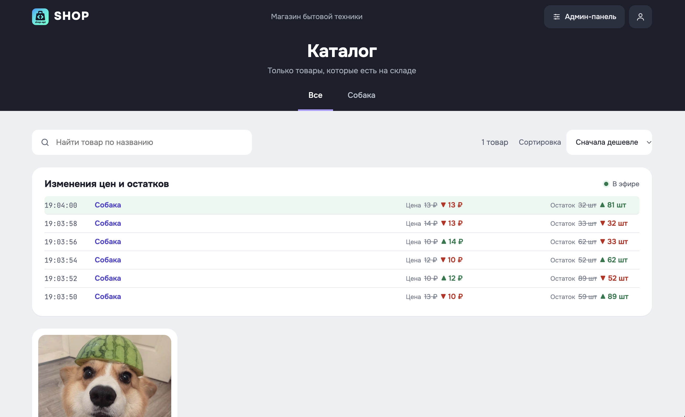
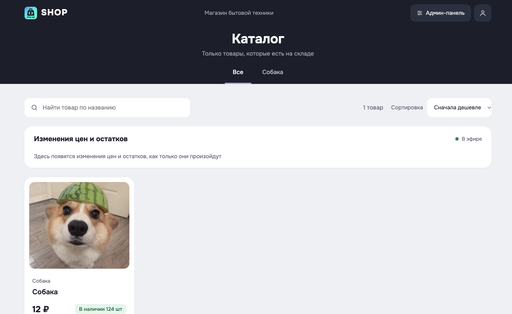
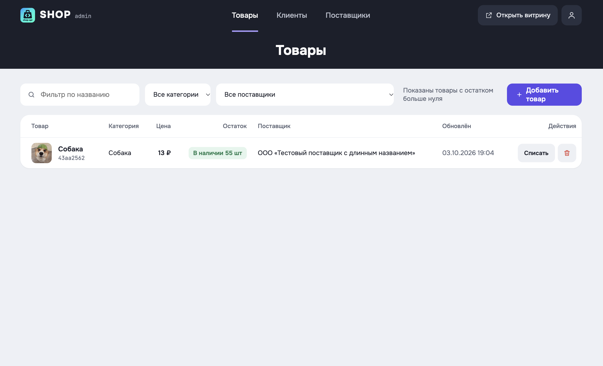
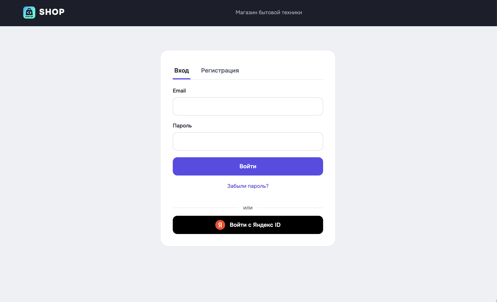
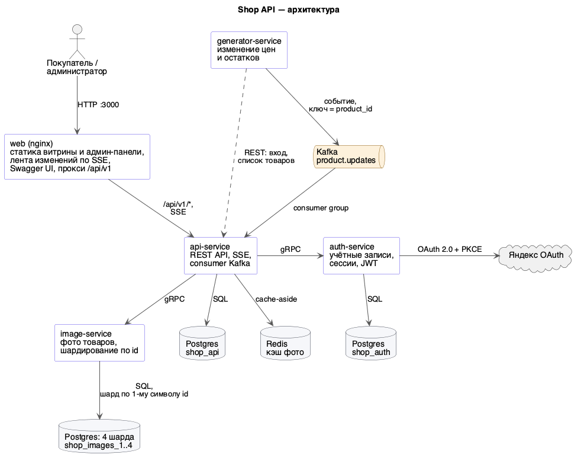
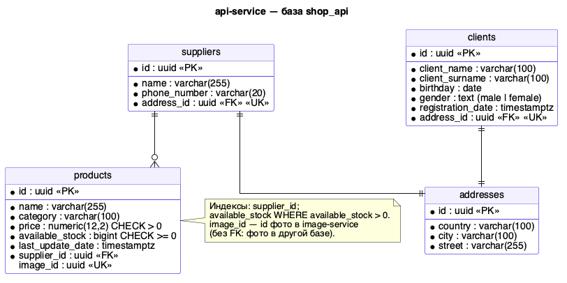
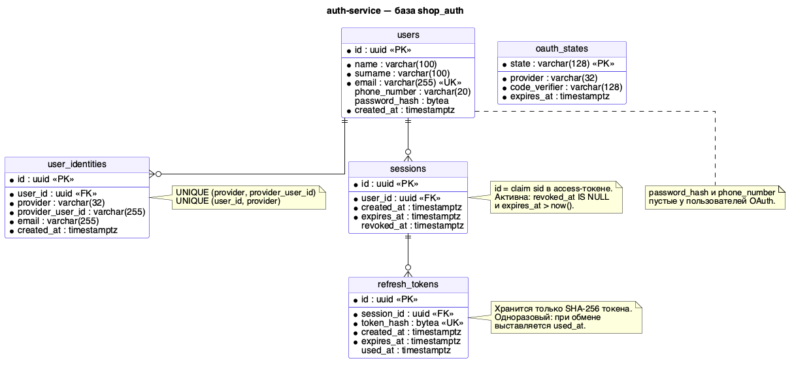
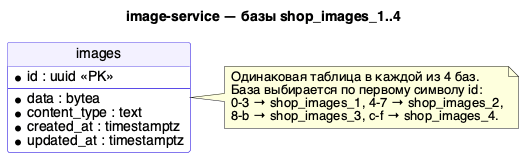

# Shop API

Данный проект выполнен, как часть Backend ветки в Школе 21.
Интернет-магазин бытовой техники. В проект входят витрина и админ-панель в
браузере, REST API на Go и несколько отдельных сервисов: авторизация, хранение
фото с шардированием и генератор изменений цен.

## Содержание

- [Скриншоты](#скриншоты)
- [Стек](#стек)
- [Архитектура](#архитектура)
- [Документация](#документация)
- [Запуск](#запуск)
- [Основные технические решения](#основные-технические-решения)
- [Что сделано](#что-сделано)
- [Разработка](#разработка)
- [Настройки](#настройки)

## Скриншоты

**Витрина: лента изменений цен и остатков в реальном времени (SSE)**



**Витрина: каталог товаров с фото из image-service**



**Админ-панель: управление товарами**



**Вход и регистрация, в том числе через Яндекс ID**



## Стек

| Область | Технологии |
|---|---|
| Бэкенд | Go 1.27, `net/http` (стандартный роутер), gRPC + Protocol Buffers (`buf`) |
| Данные | PostgreSQL 16, sqlc (код из SQL-запросов), goose (миграции), pgx |
| Сообщения и кэш | Apache Kafka 4 (режим KRaft, без ZooKeeper), Redis 7 |
| Авторизация | JWT (HS256), bcrypt, OAuth 2.0 + PKCE (Яндекс ID) |
| Фронтенд | HTML, CSS и JavaScript без фреймворков, nginx, Swagger UI |
| Инфраструктура | Docker, Docker Compose |
| Качество | `go test`, golangci-lint, `go vet`, gofmt, pre-push хук |
| Документация | OpenAPI 3, PlantUML |

## Архитектура



| Сервис | Что делает | Хранилище | Протокол |
|---|---|---|---|
| `api-service` | REST API магазина (клиенты, поставщики, товары, фото, авторизация), поток SSE, приём событий из Kafka | Postgres `shop_api`, Redis | HTTP |
| `auth-service` | учётные записи, вход по паролю и через Яндекс, сессии, access- и refresh-токены | Postgres `shop_auth` | только gRPC |
| `image-service` | хранение фото товаров в четырёх базах-шардах | Postgres `shop_images_1..4` | только gRPC |
| `generator-service` | раз в 2 с меняет цену и остаток случайного товара и публикует событие в Kafka | — | Kafka, HTTP |
| `web` | nginx: витрина, админ-панель, Swagger UI, прокси `/api/v1/*` и SSE | — | HTTP |

Основные сценарии:

- **Запрос к API.** Браузер идёт в nginx, nginx проксирует запрос в
  api-service. Middleware проверяет access-токен в auth-service по gRPC и
  только после этого пускает запрос в обработчик.
- **Фото товара.** api-service проверяет связь товара с фото в своей базе,
  ищет фото в Redis, а при промахе запрашивает его у image-service по gRPC.
  image-service читает фото из шарда, который выбирается по id фото.
- **Изменение цены.** generator-service публикует событие в Kafka.
  api-service читает его, обновляет товар в базе и рассылает обновление
  всем открытым витринам по SSE.

У каждого сервиса своя база. Другие сервисы её не читают и обращаются к
владельцу данных через его API.

Все Go-сервисы построены по Clean Architecture: `transport` → `usecase` → `domain`,
а репозитории и клиенты реализуют интерфейсы, которые объявлены там, где они
используются. Бизнес-правила живут только в `usecase`.

Подробнее — в [docs/architecture.md](docs/architecture.md).

## Документация

| Документ | Что внутри |
|---|---|
| [docs/architecture.md](docs/architecture.md) | сервисы, устройство кода, авторизация и сессии, доставка изменений, фото и шардирование |
| [docs/database.md](docs/database.md) | схемы всех баз, назначение таблиц, жизненный цикл сессии |
| [api/openapi/openapi.yaml](api/openapi/openapi.yaml) | спецификация REST API (OpenAPI 3); после запуска — Swagger UI на http://localhost:3000/docs/ |
| [api/proto/auth/v1/auth.proto](api/proto/auth/v1/auth.proto) | gRPC-контракт auth-service |
| [api/proto/image/v1/image.proto](api/proto/image/v1/image.proto) | gRPC-контракт image-service |
| [.env.example](.env.example) | все переменные окружения с комментариями |
| [docs/diagrams](docs/diagrams) | исходники диаграмм (PlantUML), картинки — в [docs/images](docs/images) |

Схемы баз данных:

| shop_api | shop_auth | shop_images_1..4 |
|---|---|---|
|  |  |  |

## Запуск

Нужен только Docker с Docker Compose. Все команды выполняются из каталога `src`.

```bash
make up
```

`make up` создаёт `.env` из `.env.example`, если его ещё нет, и собирает
образы. Затем он применяет миграции всех баз (включая четыре шарда фото),
создаёт топик Kafka и запускает весь стек. Порядок запуска задают
healthcheck-и и `depends_on`, поэтому отдельных шагов не нужно.

| Адрес | Что там |
|---|---|
| http://localhost:3000 | витрина |
| http://localhost:3000/admin/products.html | админ-панель |
| http://localhost:3000/docs/ | Swagger UI |
| http://127.0.0.1:8090 | api-service напрямую |
| 127.0.0.1:50051, 127.0.0.1:50052 | gRPC auth-service и image-service |
| 127.0.0.1:5433, 127.0.0.1:5434 | Postgres auth-service и image-service (у api-service — порт 5432) |

Первого пользователя можно зарегистрировать на странице входа или через
`POST /api/v1/auth/register`. Пароль должен быть не короче 8 символов. Вход
через Яндекс включается, если задать `OAUTH_YANDEX_CLIENT_ID` и
`OAUTH_YANDEX_CLIENT_SECRET`.

Остановить стек:

```bash
make down
```

### Прод

```bash
cp .env.prod.example .env.prod
make prod-up
```

Перед запуском заполните секреты в `.env.prod`: пароли баз (в том числе
`IMAGE_DB_PASSWORD`) и `JWT_SECRET` (не короче 32 символов). В прод-конфигурации
нет генератора, Kafka и Redis, базы и gRPC-сервисы не публикуются на хост, а
cookie с refresh-токеном ставится с флагом `Secure`.

## Основные технические решения

**API и данные**

- REST по `/api/v1/...` с DTO и мапперами между транспортом и доменом.
  Ошибки валидации возвращают 400 с кодом и текстом, отсутствующие объекты — 404,
  пустые списки — `[]`.
- Схема в 3НФ: адреса вынесены в отдельную таблицу, у всех сущностей UUID,
  у цены тип `NUMERIC(12,2)`, проверки (`price > 0`, `available_stock >= 0`)
  дублируются в базе.
- SQL пишется руками, Go-код по нему генерирует sqlc. Миграции — goose,
  их применяет отдельный одноразовый контейнер `migrator` для каждой базы.
- Фото отдаются как файл: `Content-Disposition: attachment`.

**Авторизация**

- auth-service доступен только по gRPC. Пароли хранятся как bcrypt-хэши с солью.
- Каждый вход создаёт сессию. Access-токен (JWT, 15 мин) действует, только пока
  жива его сессия, поэтому выход и смена пароля отзывают токены сразу, не
  дожидаясь их истечения.
- Refresh-токен одноразовый (ротация при каждом обмене) и хранится в базе только
  как SHA-256. Повторное предъявление использованного токена считается кражей
  и отзывает всю сессию. В браузере refresh-токен лежит в `HttpOnly`-cookie.
- Вход через Яндекс — OAuth 2.0 с PKCE и одноразовым `state` в базе.
- Сброс пароля генерирует временный пароль и вместо отправки письма пишет его
  в лог auth-service.
- Регистрация, вход и сброс пароля ограничены по частоте запросов с одного IP.

**События и real-time**

- Kafka в режиме KRaft. Ключ сообщения — `product_id`, поэтому события одного
  товара обрабатываются по порядку.
- Доставка at-least-once: offset коммитится после записи в базу. Событие несёт
  абсолютные значения цены и остатка, поэтому повторная обработка безопасна.
  Временные ошибки повторяются с экспоненциальной задержкой (до 30 с).
- SSE (`GET /api/v1/sse/products`) с пингом каждые 15 с. Браузерный `EventSource`
  не умеет передавать заголовки, поэтому для этой ручки токен можно передать в
  `?access_token=`, а nginx не пишет query-строку в журнал.

**Фото и шардирование**

- Фото хранит отдельный image-service в четырёх базах Postgres. База выбирается
  по первому символу id фото: `0-3`, `4-7`, `8-b`, `c-f`. id — случайный UUID v4,
  поэтому фото ложатся по шардам равномерно. Каждый шард задаётся своей строкой
  подключения, и его можно перенести на отдельную машину без изменения кода.
- api-service хранит только связь `products.image_id` и кэширует содержимое
  фото в Redis (cache-aside, TTL 1 ч, файлы больше 5 МБ не кэшируются).
  Если Redis недоступен, фото читаются напрямую из image-service.
- Фото передаётся по gRPC одним сообщением, поэтому лимит сообщения поднят
  до 25 МБ.

**Эксплуатация**

- `/health/live` и `/health/ready`: readiness проверяет Postgres и image-service
  (через стандартный gRPC health check).
- Graceful shutdown всех сервисов, конфигурация только через переменные окружения.

## Разработка

| Команда | Что делает |
|---|---|
| `make test` | unit-тесты бизнес-логики всех сервисов |
| `make lint` / `make vet` / `make fmt-check` | статические проверки api-service |
| `make proto-gen` / `make proto-lint` | генерация Go-кода из `api/proto` (`buf generate`) и проверка контрактов |
| `make sqlc-gen` | Go-код из SQL-запросов всех сервисов |
| `make diagrams` | PNG-диаграммы из `docs/diagrams/*.puml` |
| `make migrate-up` | применить миграции api-service вручную |
| `make logs` / `make ps` | логи и состояние контейнеров |
| `make hooks` | подключить pre-push хук (fmt-check, vet, test, lint, сборка образов) |

Тесты, линтеры и генерация кода запускаются локально, приложение и миграции —
только через Docker Compose.

Инструменты генерации на macOS:

```bash
brew install bufbuild/buf/buf sqlc plantuml
```

```bash
go install google.golang.org/protobuf/cmd/protoc-gen-go@latest
```

```bash
go install google.golang.org/grpc/cmd/protoc-gen-go-grpc@latest
```

Структура репозитория:

```
src/
├── api/                  OpenAPI-спецификация и gRPC-контракты
├── backend/
│   ├── api-service/      REST API, SSE, consumer Kafka
│   ├── auth-service/     авторизация (gRPC)
│   ├── image-service/    фото товаров, 4 шарда Postgres (gRPC)
│   ├── generator-service/
│   └── gen/              сгенерированные gRPC-стабы
├── frontend/             nginx и статика витрины и админ-панели
├── docs/                 документация и диаграммы
├── compose.yaml          dev-стек
└── compose.prod.yaml     прод-стек
```
